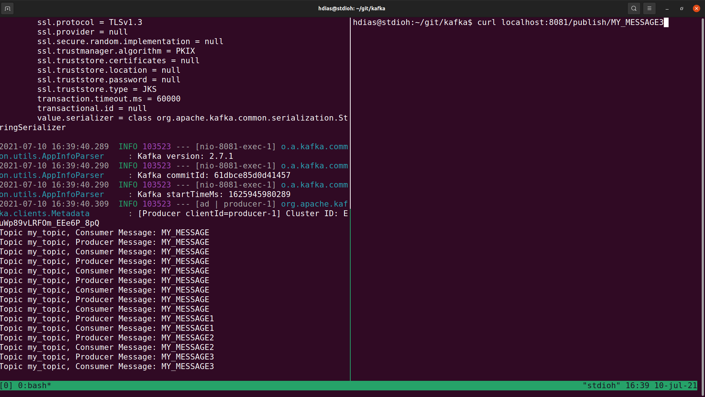
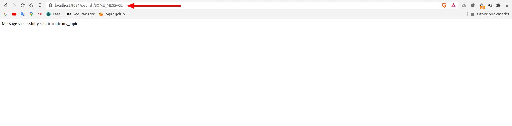
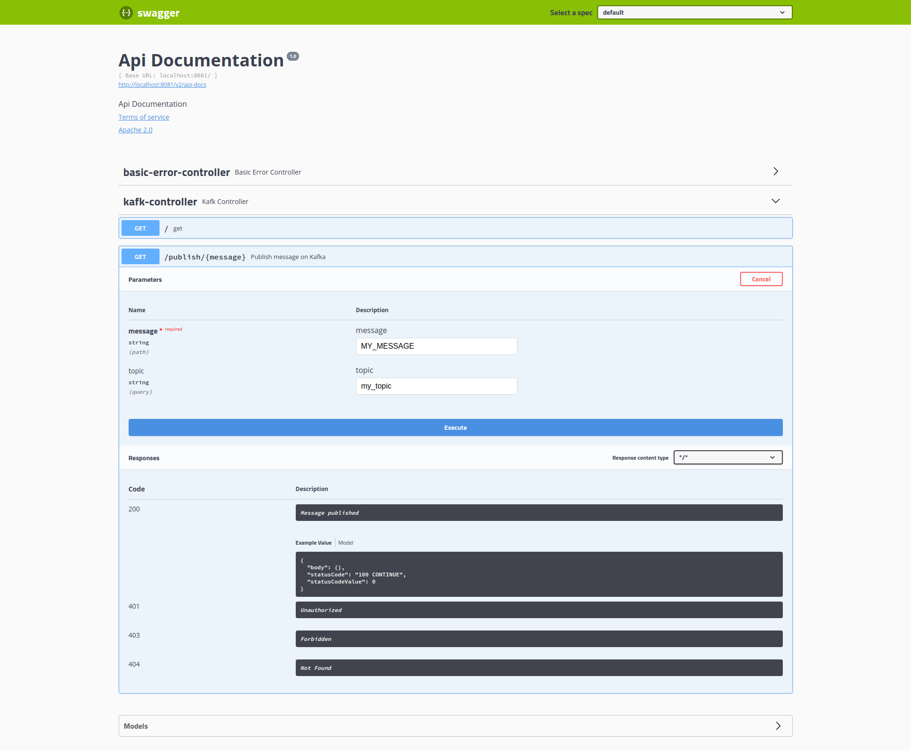

# Kafka

**Testing [Apache Kafka](https://kafka.apache.org/) using Spring Boot + Docker**


# Requirements

   * [JDK >= 11](https://jdk.java.net/11/)   
   * [Maven](https://maven.apache.org/download.cgi)
   * [Docker](https://www.docker.com/get-started)
   * [Docker Compose](https://docs.docker.com/compose/install/)
   * [Curl](https://curl.se/download.html)
### Optional

   * [Sdkman](https://sdkman.io/install) (With it you can install and manage JDK and Maven)
  

# Setup

```shell
git clone https://github.com/stdioh321/kafka.git
cd kafka
mvn build
```


# Run

```sh
docker-compose up -d
# Check if docker is running correctly
docker-compose ps

mvn spring-boot:run
# The server will run at: http://localhost:8081

```
With the server running let's try it out:


```sh
curl localhost:8081/publish/MY_MESSAGE
# OR test it on your browser
google-chrome http://localhost:8081/publish/MY_MESSAGE
```

| Curl | Browser |
|---|---|
||


# Swagger
After running the server, open your browser at:

### **http://localhost:8081/swagger-ui.html**



# References

* [Youtube Tutorial](https://www.youtube.com/watch?v=s7kVR6yK78M)
